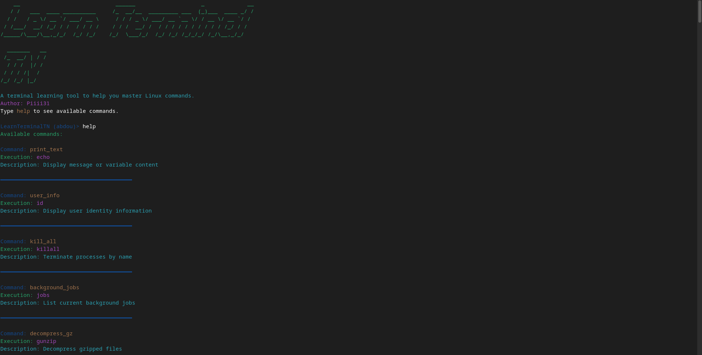

# Learn Terminal TN

[](LICENSE)
[](https://github.com/Piiii31/learnTerminalTN/releases/download/v1.0/learnTerminalTN.deb)

A terminal learning environment designed to help users master Linux commands through guided practice and command translation.



## Purpose

Learn Terminal TN aims to:
- Lower the learning curve for Linux terminal newcomers
- Provide immediate feedback and command explanations
- Offer safe practice environment with command validation
- Bridge between simplified commands and actual Linux utilities

## Key Features

- 🖥️ Custom command vocabulary with real command mapping
- 📖 Built-in explanations for 100+ common commands
- 🔍 Argument translation and validation
- 🎨 Color-coded educational interface
- 📦 Pre-configured Debian package installation
- 🛡️ Safe command execution environment

## Installation

### Debian Package
```bash
wget https://github.com/Piiii31/learnTerminalTN/releases/download/v1.0/learnTerminalTN.deb
sudo dpkg -i learnTerminalTN.deb
sudo apt install -f # Install dependencies
```

### Manual Installation
```bash
git clone https://github.com/Piiii31/learnTerminalTN.git
cd learnTerminalTN
sudo ./install.sh
```

Dependencies: figlet, bash >=4.4, gnome-terminal|xterm|konsole

## Usage

Start the learning environment:
```bash
learnterminal
```

Example session:
```bash
LearnTerminalTN (~)> go -l
Note: 'go' → 'ls' (List directory contents in simple format)
  [-l] Long listing format
total 64K
-rw-r--r-- 1 user user 2.3K Feb  1 10:00 file.txt

LearnTerminalTN (~)> user_info
Note: 'user_info' → 'id' (Display user identity information)
uid=1000(user) gid=1000(user) groups=1000(user),24(cdrom)...
```

## Command System

### Core Components

- **Command Mapping:** Over 100 simplified commands mapped to real Linux utilities
- **Argument Translation:** Common flags explained in real-time
- **Safety Checks:** Protected against dangerous commands
- **Context Help:** Type `help` for available commands

### Debian Package Contents

| Path | Description |
|------|------------|
| /usr/local/bin/learnTerminalTN | Main executable |
| /usr/local/lib/learnTerminalTN/ | Configuration files |

## Building from Source

1. Install build dependencies:
```bash
sudo apt install devscripts debhelper dh-make
```

2. Create package:
```bash
dh_make --createorig -p learnTerminalTN_1.0
dpkg-buildpackage -uc -us
```

## Contributing

1. Fork the repository
2. Create feature branch:
```bash
git checkout -b feature/amazing-feature
```
3. Commit changes:
```bash
git commit -m 'Add amazing feature'
```
4. Push to branch:
```bash
git push origin feature/amazing-feature
```
5. Open Pull Request

## Acknowledgments

- Inspired by Unix/Linux training needs in academic environments
- Built with ❤️ by Piiii31
- Tested on Debian 11/12 and Ubuntu 20.04/22.04

## License

GNU General Public License v3.0 - See [LICENSE](LICENSE) for details

